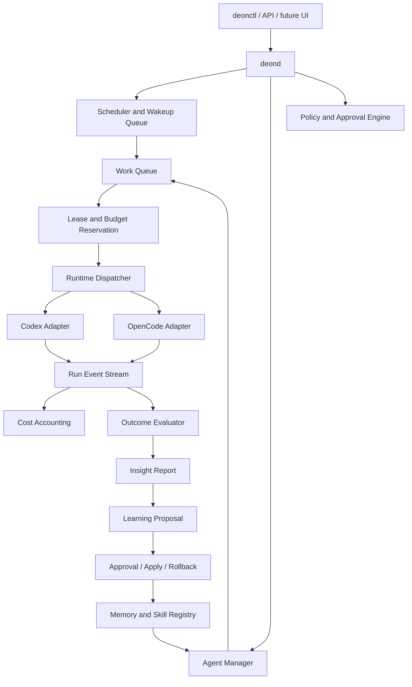

# DeonClaw

Personal multi-agent runtime and orchestration control plane.

DeonClaw coordinates external coding agents, isolated workspaces, memory domains, policies, runs, logs, artifacts, budgets and approvals. It is built for personal operations where agents can do real work, but every important boundary stays auditable.

It is not a fork of Codex, OpenCode, OpenClaw, Hermes or Paperclip. It wraps tools like these when useful and keeps DeonClaw's own control plane, governance model and execution trace.

## Why it exists

Coding agents are good at execution, but they usually lack durable operational boundaries:

- What is the task allowed to touch?
- Which memory domain can be read or changed?
- Which worker/model should run it?
- What did the worker actually do?
- Which artifacts prove the result?
- Who approved a risky action?
- What did it cost, and did it fit the budget?
- What should be learned from the run?

DeonClaw is the layer that answers those questions before, during and after agent execution.

## Core model

Agents do work. DeonClaw controls the work.

DeonClaw manages:

- structured tasks and work items
- isolated Git workspaces
- memory and domain policies
- Codex/OpenCode worker execution
- validation and release gates
- run logs, execution traces and artifacts
- MCP/tool-call proposals and approvals
- skill registry and session snapshots
- persistent agents, inboxes and delegation
- schedules, heartbeats and wakeup queues
- usage accounting, budgets and hard stops
- insight reports and learning proposals

## Current status

Functional MVP in active development.

The current active direction is **Epic 23: stable proactive multi-agent runtime**. Earlier work established the execution harness, policy, approval, memory, MCP and provider-dispatch foundations. Epic 23 moves the project toward a durable personal runtime with persistent agents, work queues, schedules, budgets and learning loops.

Implemented vertical slices include:

| Area | Status |
| --- | --- |
| Worker execution | Codex CLI and OpenCode dry-run/run paths, execution traces and run reports |
| Workspace safety | isolated Git worktrees, path policy, dirty-baseline protection and diff artifacts |
| Memory governance | proposal, lint, approval, apply, backup and restore workflow |
| MCP governance | registry validation, fake/real read-only smokes, proposal queue and explicit approval artifacts |
| Retrieval context | memory index, LanceDB smoke paths, governed materialization and prompt-preview gates |
| Provider dispatch | design, activation policy, approval packages and simulation layers; real calls remain gated |
| Skill registry | AgentSkills-compatible `SKILL.md` import/install/verify/enable/snapshot/materialize foundation |
| Persistent agents | agent identities, sessions, inboxes, assignment and delegation proposal workflow |
| Proactive runtime | schedules, wakeups, heartbeat dry-run, daemon state and fixture smoke |
| Work queue | immutable task snapshots, leases, recovery and read-only doctor |
| Costs and budgets | pricing ledger, usage events, budget windows, reservations, commits and hard stops |
| Budgeted dispatch | fake worker dispatch with lease, budget, skill snapshot and insight-review evidence |

**Epic 23.16–23.19.1** (work queue, leases, budgets, and budgeted fake dispatch) is **merged and operational on `main`**. CI smokes: `make work-queue-smoke`, `make budgeted-dispatch-smoke`, `make proactive-runtime-smoke`, `make provider-call-chain-smoke`.

**Next:** closed learning loop fake E2E (`23.20–23.23`) — evidence → insight review → proposal → skill apply → session → effectiveness. See [Epic 23 Roadmap](docs/EPIC_23_ROADMAP.md).

## What is deliberately not active yet

Some pieces are designed but intentionally held behind gates:

- long-running `deonclawd` process
- automatic real worker dispatch from wakeups
- real fallback execution/retries
- Codex Docker worker execution
- automatic MCP/tool execution
- real provider calls
- active natural-language retrieval inside runner prompts
- automatic skill or memory apply from learning proposals
- UI/dashboard

This is intentional. The project is proving vertical slices before allowing unattended real execution.

## Architecture direction



## Repository map

```text
cmd/deonctl/       CLI entrypoint
internal/          core packages for workers, stores, policy, budgets and runtime flows
configs/examples/  runnable policies, workers, domains and fixture trees
docs/              design docs, ADRs, runbooks and Epic 23 plans
examples/tasks/    sample structured tasks
scripts/           smoke tests and validated ship helpers
```

## Key docs

- [Epic 23 Roadmap](docs/EPIC_23_ROADMAP.md)
- [Budgets and Costs](docs/BUDGETS_AND_COSTS.md)
- [Budgeted Dispatch](docs/BUDGETED_DISPATCH.md)
- [Persistent Agents](docs/PERSISTENT_AGENTS.md)
- [Proactive Runtime](docs/PROACTIVE_RUNTIME.md)
- [Universal Skills](docs/UNIVERSAL_SKILLS.md)
- [Insight and Learning Loop](docs/INSIGHT_LEARNING_LOOP.md)
- [OpenClaw Migration Plan](docs/OPENCLAW_MIGRATION.md)
- [Rich Runtime Actions](docs/RICH_RUNTIME_ACTIONS.md)

## Quick start

Requirements:

- Go 1.22+
- Git
- SQLite support through the Go dependencies

Build and test:

```bash
make build
make test
```

Run the main doctor:

```bash
./bin/deonctl doctor
```

Run the current fake-only budgeted dispatch smoke:

```bash
make budgeted-dispatch-smoke
```

## Example commands

```bash
# Worker diagnostics
deonctl workers doctor \
  --worker opencode \
  --workers-config configs/examples/workers.yaml \
  --profiles

# Dry-run a worker smoke task
deonctl workers smoke \
  --worker opencode \
  --task examples/tasks/opencode-smoke.yaml \
  --store deonclaw.db \
  --artifacts-dir artifacts \
  --workers-config configs/examples/workers.yaml \
  --dry-run

# Inspect runs
deonctl runs report --store deonclaw.db
deonctl runs report --store deonclaw.db --by model_profile

# Run fake-only budgeted dispatch through the fixture
make budgeted-dispatch-smoke
```

## Safety boundaries

DeonClaw's default posture is governed execution, not blind autonomy.

- no direct write to canonical memory without proposal/approval flow
- no automatic real provider call from design artifacts
- no automatic MCP execution from worker suggestions
- no automatic learning apply for skill/memory/policy changes
- no unattended real worker dispatch until lease, budget and approval gates are mature
- no mixing general memory with isolated domain memory such as Escalasoft

## Non-goals

- build a full AI model or provider from scratch
- store OAuth tokens inside DeonClaw
- fork Codex, OpenCode, OpenClaw, Hermes or Paperclip
- build a UI before CLI/core execution is stable
- turn every governance idea into another metadata-only gate

## Development

Common commands:

```bash
make fmt
make test
make build
make work-queue-smoke
make budgeted-dispatch-smoke
```

Before publishing a finished change from the active repo, use:

```bash
make ship
```

`make ship` runs the repository's validated commit/push workflow.
