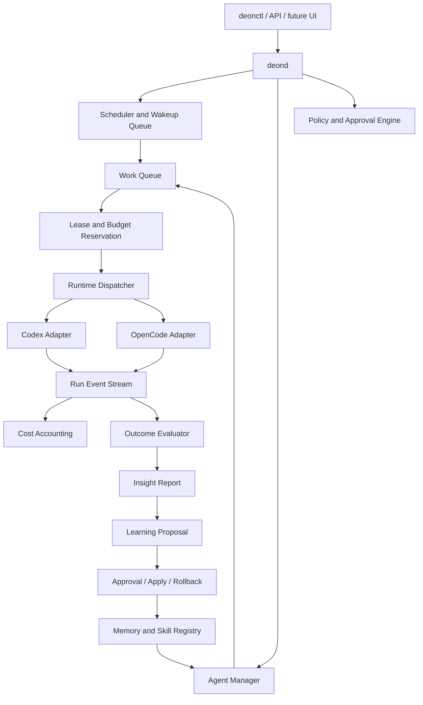

# Epic 23 — Stable Proactive Multi-Agent Runtime

## Purpose

Epic 23 moves DeonClaw from a manually invoked, strongly governed execution harness into a stable personal multi-agent runtime.

Tasks 22.0–22.68 established the contract, policy, approval, hashing, anti-leak, fixture, and release-gate foundation around memory retrieval, prompt materialization, provider dispatch, and future real execution. Epic 23 deliberately changes the center of gravity:

- from additional metadata-only gates to operational vertical slices;
- from one-shot workers to persistent agents;
- from manual invocation to scheduled and event-driven work;
- from passive logs to actionable insight and learning;
- from tool-specific skills to a portable skill registry;
- from unmetered runs to atomic cost and budget control;
- from OpenClaw dependency to a reversible migration path;
- from terminal-only operations to generic Git, browser, and action contracts.

The project remains a personal control plane. It is not a fork of Codex, OpenCode, OpenClaw, Hermes, or Paperclip.

## Current baseline

At the start of Epic 23, DeonClaw already provides:

- real Codex CLI and OpenCode worker execution;
- isolated Git worktrees and path policy;
- structured tasks, runs, events, artifacts, and approvals;
- memory proposal/apply/restore governance;
- MCP registry and governed read-only execution foundations;
- memory indexing and controlled LanceDB smoke paths;
- governed retrieval-context materialization and injection contracts;
- a complete provider-dispatch design and preimplementation gate;
- CI and end-to-end fixtures for the provider-call chain.

The principal missing capabilities are:

- persistent agents and sessions;
- daemon/runtime ownership;
- cron, heartbeat, hooks, and wakeup queues;
- work assignment, delegation, dependencies, and execution leases;
- cost accounting and budget hard stops;
- self-evaluation and learning from runs;
- portable skill installation and session snapshots;
- active retrieval and automatic MCP/tool orchestration;
- generic Git/browser actions and an operator UI/API.

## Core model

The following concepts must remain separate:

| Concept | Responsibility |
|---|---|
| `Agent` | Persistent identity, role, goals, memory scope, skill policy, budget, and schedules |
| `Worker` | Execution backend such as Codex CLI or OpenCode |
| `ModelProfile` | Provider/model/auth selection used by a worker |
| `Session` | Durable agent context and skill snapshot across runs |
| `WorkItem` | Assignable unit of work with priority, dependencies, and acceptance criteria |
| `Run` | One concrete attempt to execute a work item |
| `Schedule` | Cron, interval, one-shot, webhook, or heartbeat trigger |
| `Skill` | Versioned portable procedural knowledge loaded into sessions |
| `Insight` | Evidence-backed conclusion produced from completed work |
| `LearningProposal` | Governed memory, skill, rule, eval, workflow, or documentation change |

A worker is not an agent. Codex and OpenCode are execution runtimes attached to persistent DeonClaw agents.

## Target architecture



## Implementation order

The order is dependency-driven. A later epic may be researched earlier, but production activation must follow this sequence.

### 23A — Insight and Learning Kernel (`23.0–23.3`)

Build the first complete learning vertical slice:

1. evidence bundle and trigger policy;
2. Codex/OpenCode reflection evaluator;
3. insight and learning-proposal lifecycle;
4. approval, apply, reuse, and effectiveness measurement.

Detailed design: [INSIGHT_LEARNING_LOOP.md](INSIGHT_LEARNING_LOOP.md).

### 23B — Universal Skill Registry (`23.4–23.7`)

Adopt AgentSkills-compatible `SKILL.md` as the portable format. Add discovery, import, verification, provenance, versioning, per-agent permissions, immutable session snapshots, and adapters for Codex, OpenCode, OpenClaw, and Hermes.

Detailed design: [UNIVERSAL_SKILLS.md](UNIVERSAL_SKILLS.md).

### 23C — Persistent Agents and Sessions (`23.8–23.11`)

Introduce persistent agent identity, roles, capabilities, lifecycle, goals, sessions, inboxes, delegation, and worker/model bindings.

Detailed design: [PERSISTENT_AGENTS.md](PERSISTENT_AGENTS.md).

### 23D — Proactive Runtime (`23.12–23.15`)

Introduce `deond`, durable schedules, wakeups, cron, heartbeats, active hours, event hooks, concurrency policies, idempotency, timeout/cancellation, and orphan recovery.

Detailed design: [PROACTIVE_RUNTIME.md](PROACTIVE_RUNTIME.md).

### 23E — Work Queue, Costs, and Budgets (`23.16–23.19`)

Add atomic checkout, leases, usage normalization, cost events, budget reservations, warning thresholds, hard stops, and budget-aware routing.

Detailed design: [BUDGETS_AND_COSTS.md](BUDGETS_AND_COSTS.md).

### 23F — OpenClaw Migration (`23.20–23.23`)

Provide inspect, plan, apply, verify, shadow, cutover, and rollback flows for OpenClaw agents, skills, memory, cron, heartbeat, and session metadata.

Detailed design: [OPENCLAW_MIGRATION.md](OPENCLAW_MIGRATION.md).

### 23G — Rich Runtime Actions and Worker Adapters (`23.24–23.27`)

Add generic Git actions, browser preview/annotation, action buttons, richer Codex/OpenCode session adapters, cancellation, streaming, usage capture, and result handoff.

Detailed design: [RICH_RUNTIME_ACTIONS.md](RICH_RUNTIME_ACTIONS.md).

## Dependency graph

```text
23A Insight Kernel
  └── feeds learning proposals into 23B skills and memory

23B Skill Registry
  └── required for immutable session skill snapshots

23C Persistent Agents
  ├── required by heartbeat ownership
  ├── required by budgets per agent
  └── required by OpenClaw agent migration

23D Proactive Runtime
  ├── requires persistent agents and sessions
  └── provides schedules and wakeups for migration shadow mode

23E Queue and Budgets
  ├── required before unattended execution
  └── required before real provider/network activation

23F OpenClaw Migration
  ├── passive inventory may begin earlier
  └── execution cutover requires 23C–23E

23G Rich Actions
  ├── can begin with read-only Git/browser actions
  └── mutating actions require queue, budget, and approval enforcement
```

## Required vertical slices

Each epic must close at least one real end-to-end path. Schema-only completion is not sufficient.

### Learning slice

```text
OpenCode changes code
→ validations and events are captured
→ Codex reviews evidence
→ insight is created
→ skill proposal is approved
→ skill is installed
→ a later Codex/OpenCode session loads it
→ an eval records whether the behavior improved
```

### Proactivity slice

```text
schedule is stored
→ deond restarts
→ wakeup remains durable
→ assigned agent receives the work once
→ lease and budget are reserved
→ worker runs
→ result and cost are recorded
→ heartbeat reports only when action is needed
```

### Migration slice

```text
OpenClaw inventory
→ deterministic migration plan
→ passive skill and memory import
→ shadow heartbeat comparison
→ explicit cutover
→ rollback restores OpenClaw ownership
```

## Stability principles

1. **Pinned dependencies and skills.** No silent updates.
2. **Git and Markdown remain canonical** for user-controlled memory and skills.
3. **SQLite owns operational state** such as queues, schedules, sessions, leases, and costs.
4. **Every mutation is attributable** to an agent, operator, run, approval, and evidence set.
5. **Automatic evaluation is allowed; automatic application is not the default.**
6. **No hidden chain-of-thought storage.** Store evidence, observations, conclusions, and proposals only.
7. **Fail closed** on missing policy, stale hashes, budget exhaustion, unknown skills, or broken provenance.
8. **Shadow before cutover.** Migrations and proactive behaviors must support dry-run and comparison modes.
9. **Adapters are replaceable.** Codex, OpenCode, browser, channels, and future runtimes do not own core state.
10. **Operational progress over gate proliferation.** New gates must protect a real capability, not substitute for it.

## Cross-cutting artifacts

Every Epic 23 feature should produce or update:

- structured events;
- a machine-readable result artifact;
- a human-readable report where useful;
- source hashes and provenance;
- negative tests for boundary violations;
- an end-to-end fixture;
- a doctor/report command;
- documentation and migration notes;
- a CI target or extension to an existing smoke target.

## Definition of Done for every sprint

A sprint is complete only when all applicable items are satisfied:

- implementation and narrow interfaces;
- CLI wiring and helpful missing-flag errors;
- SQLite migration or explicit reason no migration is needed;
- unit tests including negative cases;
- library e2e and CLI e2e;
- fixture/example config;
- documentation updated in the same sprint;
- `gofmt -w .`;
- `git diff --check`;
- `go test ./...`;
- relevant smoke target passes;
- feature branch, push, draft PR, CI review;
- no secrets, memory vault contents, or generated credentials committed.

## Documentation ownership

When an implementation changes an epic contract, update:

- this roadmap if sequencing or scope changed;
- the corresponding detailed epic document;
- `README.md` status and links;
- `AGENTS.md` if agent workflow or repository rules changed;
- relevant ADR/checklist documents;
- fixture README and smoke script when the executable path changed.

## Deferred work

The following are intentionally after the operational foundation:

- full dashboard and mobile surfaces;
- multi-company isolation;
- unrestricted autonomous skill application;
- unrestricted provider/network dispatch;
- automatic MCP mutation without review;
- model fine-tuning or reinforcement learning;
- public skill marketplace hosting.

These may be designed early but must not delay the first stable personal runtime.